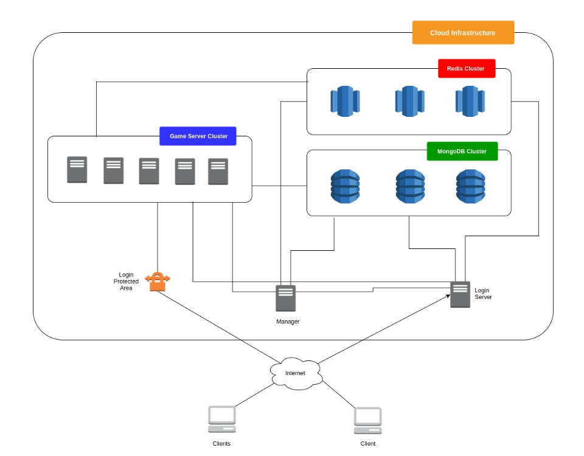

# PNP
PNP (PNP is Not PokemonGo) is a Massive Multiplayer Online Roleplaying Game (MMORPG) completely developed in C. It uses Redis as message broker and MongoDB as document store. 

Refer to `packet_specs.md` for detailed packet structure.

# Server-side dependencies
- MongoDB
- Redis

# Dev dependencies
- Hiredis
- MongoC
- SDL

On an Ubuntu 16.04 you can run `install_deps.sh` to install all the dependencies.

